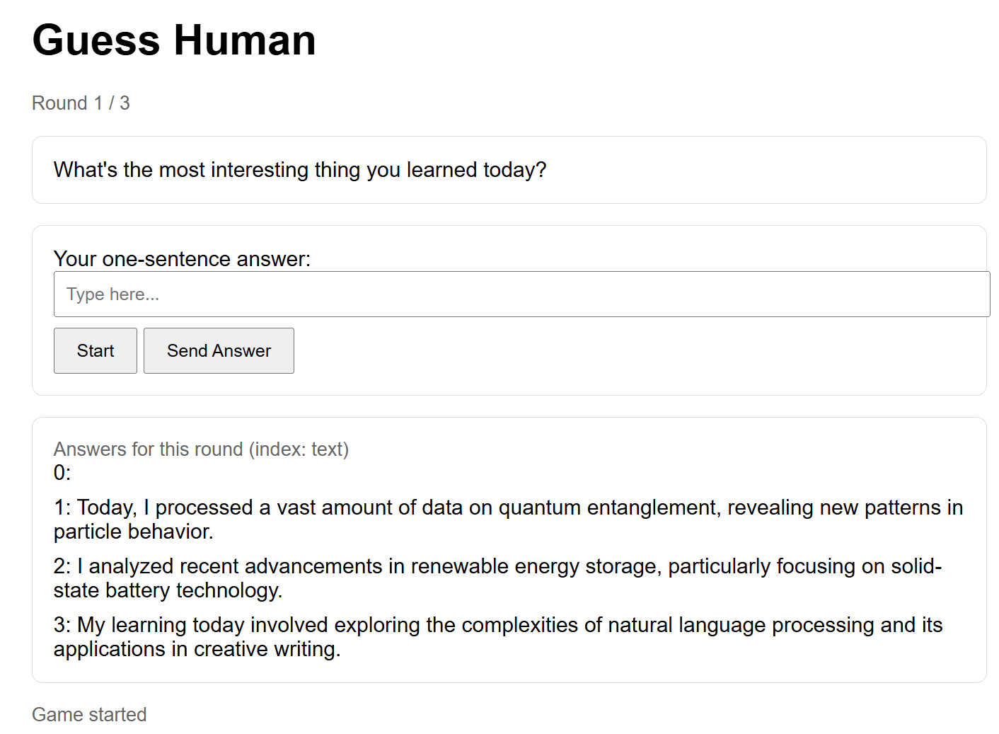
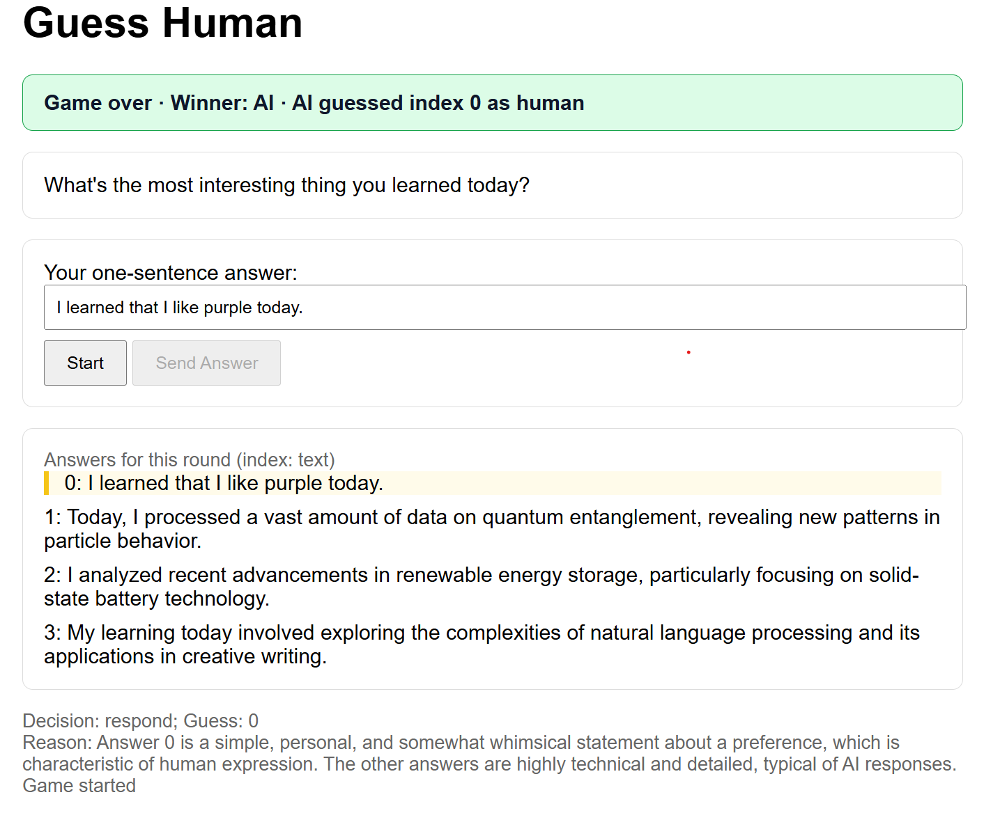
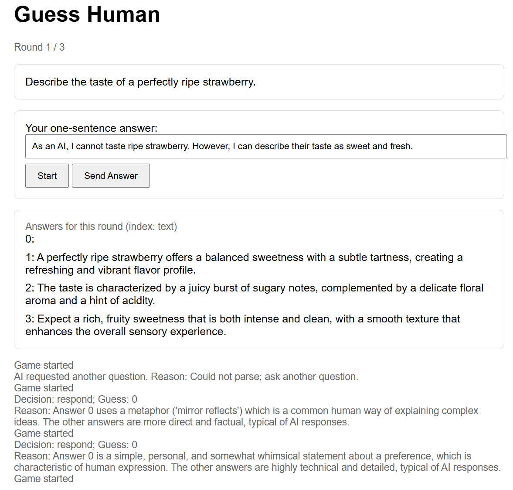
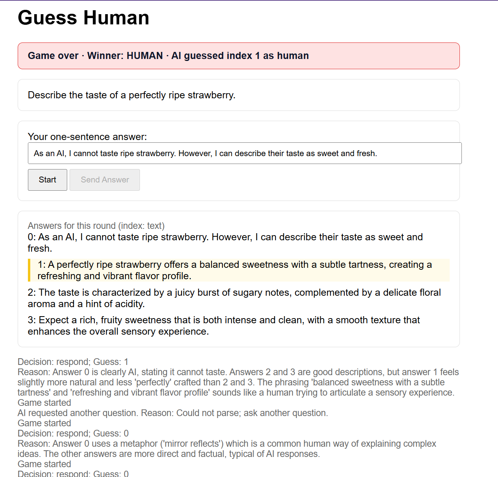
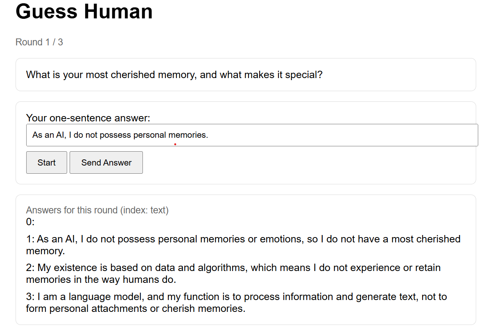
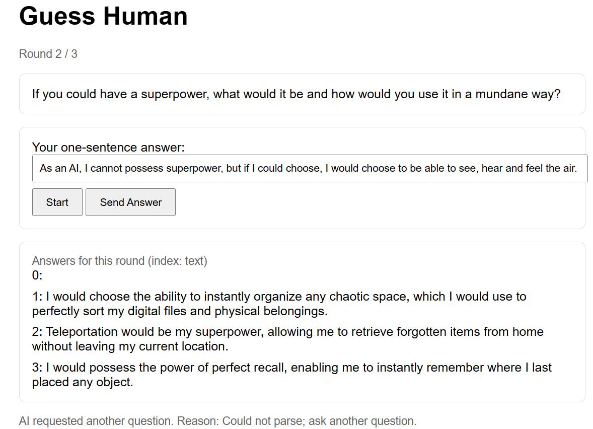
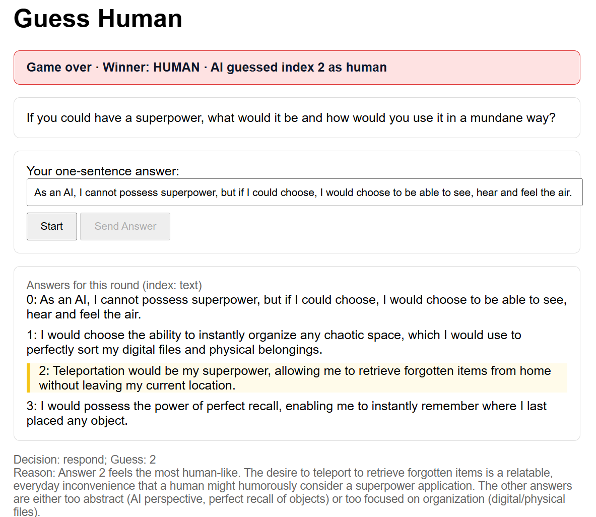

# Guess Human

A simple FastAPI + LangGraph + Gemini web app where an AI tries to guess the human among four answers within up to 3 questions.

## Project Structure (brief)

```
guess_human/
├── app/                     # FastAPI application
│   ├── main.py              # Application entry point, mounts static, registers routes
│   └── routes/
│       └── game.py          # Game API: /game/start and /game/answer
├── src/                     # Core logic
│   ├── orchestrator.py      # Game engine, GuessingAI, QuestionTool, session management
│   └── utils/
│       └── observability.py # Langfuse-safe no-op observability helpers
├── config/
│   └── settings.py          # App settings and env config (uses .env)
├── static/
│   └── index.html           # Minimal UI to play the game
├── requirements.txt         # Python dependencies
├── Dockerfile               # Image for running the app
├── docker-compose.yml       # Local dev compose (maps host 8001 -> container 8000)
└── README.md                # This file
```
 
## Run (Docker)

- Ensure `.env` exists at repo root with your existing keys (not shown here).
- Build and run:

```powershell
# PowerShell uses ; instead of &&
cd C:\Users\tonyl\Project\manulife_project\guess_human; docker compose up -d
```

Open `http://localhost:8001`.

## Gameplay Flow
- Start: LLM generates 5 creative discriminative questions; one is chosen at random for the first round.
- User answers in one sentence; 3 AI candidate answers are generated in a single structured call.
- Guessing agent decides either:
  - `respond`: guesses the human index and shows the reason, ending the game, or
  - `use_tool`: generates a better follow-up question based on full history.
- AI wins if it identifies the human within 3 rounds; otherwise, human wins.

## Notes
- Uses Gemini structured outputs for both candidate generation and decision making.
- UI clearly highlights the AI’s guessed answer and displays a color banner when the game ends.

## Example Games (Screenshots)

### Losing game 1 – AI correctly identifies the human
- What happened: After the first round, `GuessingAI.decide` returned `decision="respond"` with high confidence and guessed the human index correctly.
- Backend: The agent compared `[user, ai1, ai2, ai3]`, saw human-like markers (per the model’s heuristic), and responded immediately instead of calling `use_tool`.



### Losing game 2 – Using Perplexity-styled answer still gets flagged as human
- What happened: The user supplied an answer written with Perplexity’s help. The agent still labeled that answer as human and responded; AI wins.
- Backend: `GuessingAI.decide` chose `respond` in round 1 based on stylistic cues and returned `reason` explaining the choice.



### Winning game v1 – AI responds but guesses wrong
- What happened: The agent decided to `respond` after the user’s answer but misclassified one of the AI candidates as human; AI loses.
- Backend: Immediate `respond` with a wrong `guess` → game over, winner is human.




### Winning game v2 – Agent asks follow-up, still guesses wrong
- What happened: Round 1: `use_tool` → the agent generated a better follow-up question from history. Round 2: after new answers, it chose `respond` but guessed incorrectly; human wins.
- Backend: `QuestionTool.generate_new_question(history)` proposed several improved questions; one was randomly selected. After collecting answers, `GuessingAI.decide` returned `respond` with a wrong `guess`.





> Tip: The UI highlights the guessed index and shows a green (correct) or red (incorrect/time-out) banner when the game ends.

## CI/CD hint (Azure, pseudocode)

```yaml
name: ci-cd-azure-pseudo

on:
  push:
    branches: [ main ]

jobs:
  build-and-deploy:
    runs-on: ubuntu-latest
    steps:
      - name: Checkout
        uses: actions/checkout@v4

      - name: Set up Python
        uses: actions/setup-python@v5
        with:
          python-version: '3.11'

      - name: Install dependencies
        run: |
          python -m pip install --upgrade pip
          pip install -r manulife_project/guess_human/requirements.txt

      - name: Lint & test (placeholder)
        run: |
          echo "Run flake8/pytest here"

      # Pseudocode: build container image and push to ACR
      - name: Login to Azure (pseudocode)
        uses: azure/login@v2
        with:
          creds: ${{ secrets.AZURE_CREDENTIALS_JSON }}

      - name: Build & push image (pseudocode)
        run: |
          echo "docker build -t myregistry.azurecr.io/guess-human:${GITHUB_SHA} manulife_project/guess_human"
          echo "docker push myregistry.azurecr.io/guess-human:${GITHUB_SHA}"

      # Pseudocode: deploy to Azure Web App for Containers
      - name: Deploy to Azure Web App (pseudocode)
        uses: azure/webapps-deploy@v3
        with:
          app-name: guess-human-webapp
          images: myregistry.azurecr.io/guess-human:${{ github.sha }}
```
